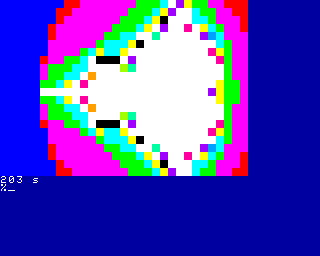

# Fraktal

Der Ursprung ist ein BASIC-Programm, welches als Benchmark dient:
<pre>
5 PAPER 0:CLS
10 TIME = 275 : REM Laufzeit manuell ermittelt
20 FOR PY=0 TO 21
30 FOR PX=0 TO 31
40 XZ = PX*3.5/32-2.5
50 YZ = PY*2/22-1
60 X = 0
70 Y = 0
80 FOR I=0 TO 15
90 IF X*X+Y*Y > 4 THEN GOTO 150
100 XT = X*X - Y*Y + XZ
110 M = X*Y
120 Y = M+M + YZ
130 X = XT
140 NEXT I
150 INK I
160 PRINT CHR$(219);
170 NEXT PX
180 PRINT CHR$(13);
190 NEXT PY
200 PRINT TIME;"s"
</pre>

Besonderheiten:
- Verwendung von CTC-Kanal 2 zur Laufzeitmessung  
- Einsatz von 'printf'  
- Verwendung von Fließkommazahlen  

## Ergebnis

## Compilerausgabe
<pre>
$ make
Assemble: sdasz80  -plsgff  -o  crt0.rel crt0.s
Assemble: sdasz80  -plsgff  -o  header.rel header.s
Compile:  sdcc     -mz80  --fomit-frame-pointer       -Wall  -S -D_DATESTAMP_=\"$(date +"%d.%m.%Y")\"  fraktal.c   -o fraktal.asm
Assemble: sdasz80  -plsgff  -o  fraktal.rel fraktal.asm
Compile:  sdcc     -mz80  --fomit-frame-pointer       -Wall  -S -D_DATESTAMP_=\"$(date +"%d.%m.%Y")\"  z80_ctc.c   -o z80_ctc.asm
Assemble: sdasz80  -plsgff  -o  z80_ctc.rel z80_ctc.asm
Link:     sdldz80  -mjwx  -b _KCC_HEADER=0x180 -b _CODE=0x200 -l caos.lib -l printf.lib -l z80_float.lib  -i main.ihx  crt0.rel header.rel fraktal.rel z80_ctc.rel
ASlink >> -m
ASlink >> -j
ASlink >> -w
ASlink >> -x
ASlink >> -b _KCC_HEADER=0x180
ASlink >> -b _CODE=0x200
ASlink >> -l caos.lib
ASlink >> -l printf.lib
ASlink >> -l z80_float.lib
ASlink >> -i
ASlink >> main.ihx
ASlink >> crt0.rel
ASlink >> header.rel
ASlink >> fraktal.rel
ASlink >> z80_ctc.rel
OBJ copy: sdobjcopy  -I ihex -O binary   main.ihx main.kcc
mv main.kcc TFRAKTAL.KCC
rm z80_ctc.asm fraktal.asm
</pre>
