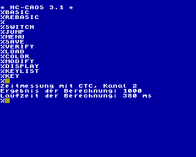

# Zeitmessung mit CTC-Kanal

Der Z80-CTC ist ein Baustein der Z80-Familie, der für's Zählen und zur Erzeugung von Frequenzen zuständig ist.

Im KC85 (KC85/2 bis KC85/5) aus Mühlhausen ist im Grundgerät ein Schaltkreis verbaut, der dort u.a. für die Tonerzeugung, die Blinkfrequenz zuständig ist.

Der CTC-Baustein besitzt vier Eingänge und drei Ausgänge.

Beim KC85 werden die CTC-Kanäle wie folgt genutzt:

Kanal | Signal  | Frequenz | Nutzung         | Ausgang
----- | ------  | -------- | -------         | -------
0     | h4      | 27 kHz   | Tonhöhe rechts  | K0 Sound rechts (+Piezo)
1     | h4      | 27 kHz   | Tonhöhe links   | K1 Sound links
2     | /BI     | 50 Hz    | Tondauer        | Blink
3     | /BI     | 50 Hz    | Tastatur        | entfällt

Der CTC Kanal 2 läßt sich ohne größere Nebenwirkungen in eigenen Programmen für die Messung von Zeiten nutzen.

Eine mögliche Anwendung zeigt dieses Beispielprogramm:  

